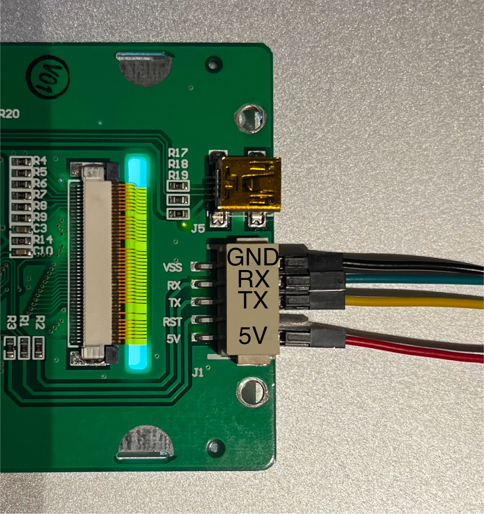
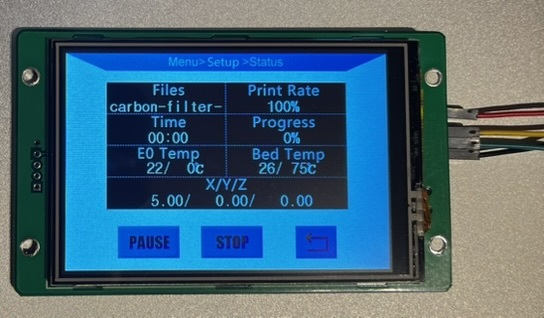
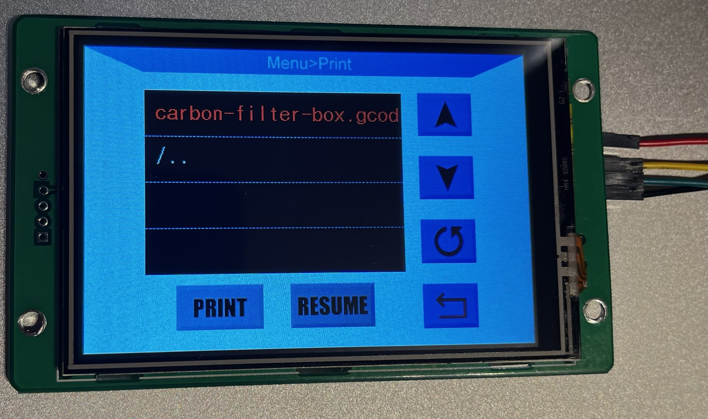

# KlipperTFT (for Anycubic-i3-Mega TFT screens)
Want to run Klipper on your Anycubic-i3-Mega? And still want to be able to use your Anycubic-i3-Mega TFT touch screen?

Take a look at this python service.

Forked from [joakimtoe/KlipperLCD](https://github.com/joakimtoe/KlipperLCD) and based on the work of Marlin [`anycubic_i3mega_TFT.cpp`](https://github.com/MarlinFirmware/Marlin/blob/eaab2dea925f0da5b38fcec1c58e9b8806efbaf8/Marlin/src/lcd/extui/anycubic_i3mega/anycubic_i3mega_lcd.cpp)

Thank you for your Work!!!

Running together with Klipper3d and Moonraker!

> [!WARNING]
> I haven't yet had a chance to test the display and all the functions down to the last detail. **However, most of them should work.**
> Nevertheless, some functions cannot be implemented due to the functional scope of the display and the communication protocol. **This is a work in progress. There is no guarantee. Be careful, watch your printer, double check things. Use it as is. I am not responsible for any damages or consequences of any kind.**

## ToDo
* [ ] Get every currently function completely tested and verified
* [ ] Verify Mega X Display wiring / compatibility
* [ ] Reset print status page on Emergency stop
* [ ] Resume print after power-outage
* [ ] Support for the anycubic_chiron?
* [ ] Figure the missing J-Commands out
* [ ] Ensure that the controller responds appropriately to requests from the display with J commands
* [ ] Possibly, improve the file/directory traversing in the file explorer? -> Needs a press on the UP-Arrow or Refresh button after changing directories
* [ ] Improve Error Handling of the code and in case of edge cases
* [ ] Use types for vars?
* [ ] Use ENV vars to configure UART-Port and moonraker address and configure the service via systemd-service / `/etc/defaults`
* [ ] Maybe a context manager for the uart port
* [ ] Use the special menu for Stuff like bed leveling

## Whats needed?
* A Anycubic-i3-Mega TFT Screen (any from [THIS](https://github.com/knutwurst/Marlin-2-0-x-Anycubic-i3-MEGA-S/wiki/Types-of-Anycubic-Touchscreens) list should work).
* A Raspberry Pi or similar SBC to run Klipper. I suggest using the [Klipper Installation And Update Helper (KIAUH)](https://github.com/dw-0/kiauh) to setup and install Klipper, Moonraker and the web user interface of choice ([Fluidd](https://docs.fluidd.xyz/)/[Mainsail](https://docs.mainsail.xyz/)).
* Some re-wiring of the TFT screen to connect it to one of the UARTs availible on your Raspberry Pi / SBC or through a USB to UART converter.
* Then you can follow this guide to enable your Anycubic-i3-Mega touch screen again!

## Wire the TFT
When wiring your screen, you can either wire it directly to one of your Raspberry Pi / SBC availible UARTs or you can wire it through a USB to UART converter. Both options are described below, pick the option that suits your needs.

### To a Raspberry Pi UART
1. Remove the back-cover of the TFT by unscrewing the four screws.

2. Connect the TFT to the Raspberry Pi UART according to the table below:

    | Raspberry Pi  | TFT               |
    | ------------- | ----------------- |
    | Pin 4 (5V)    | 5V  (Red wire)  |
    | Pin 6 (GND)   | GND (Black wire)    |
    | GPIO 14 (TXD) | RX  (Green wire)  |
    | GPIO 15 (RXD) | TX (Yellow wire)  |

    <p float="left">
        
        
    </p>

### USB to UART Converter
Quite simple, just remember to cross RX and TX on the TFT and the USB/UART HW.
| USB <-> UART HW | TFT               |
| --------------- | ----------------- |
| 5V              | 5V  (Red wire)  |
| GND             | GND (Black wire)    |
| TXD             | RX  (Green wire)  |
| RXD             | TX (Yellow wire)  |

<p float="left">
    
    
</p>

## Enable the UART
> **_Note_**: You can safely skip this section if you wired the display through a USB to UART converter
### [Disable Linux serial console](https://www.raspberrypi.org/documentation/configuration/uart.md)
  By default, the primary UART is assigned to the Linux console. If you wish to use the primary UART for other purposes, you must reconfigure Raspberry Pi OS. This can be done by using raspi-config:

  * Start raspi-config: `sudo raspi-config.`
  * Select option 3 - Interface Options.
  * Select option P6 - Serial Port.
  * At the prompt Would you like a login shell to be accessible over serial? answer 'No'
  * At the prompt Would you like the serial port hardware to be enabled? answer 'Yes'
  * Exit raspi-config and reboot the Pi for changes to take effect.

  For full instructions on how to use Device Tree overlays see [this page](https://www.raspberrypi.org/documentation/configuration/device-tree.md).

  In brief, add a line to the `/boot/config.txt` file to apply a Device Tree overlay.

    dtoverlay=disable-bt

## Run the KlipperTFT service
* SSH into your Raspberry Pi

### Klipper socket API
* Make sure Klipper's API socket is enabled by reading the Klipper arguments.

    Command:

        cat ~/printer_data/systemd/klipper.env

    Response:

        KLIPPER_ARGS="/home/pi/klipper/klippy/klippy.py /home/pi/printer_data/config/printer.cfg -I /home/pi/printer_data/comms/klippy.serial -l /home/pi/printer_data/logs/klippy.log -a /home/pi/printer_data/comms/klippy.sock"

    The KLIPPER_ARGS should include `-a /home/pi/printer_data/comms/klippy.sock`. If not add it to the klipper.env file!

### Install dependencies
    sudo apt-get install python3-pip git
    pip install pyserial

### Get the code
    git clone https://github.com/judokan9/KlipperTFT_UART.git
    cd KlipperTFT_UART

### Configure the code
* Open `main.py` and find the `class KlipperTFT` declaration:
```python
class KlipperTFT ():
    def __init__(self):
        ...
        TFT("/dev/ttyAMA0", callback=self.lcd_callback)
        ...
```
* If your UART is something other than the default `ttyAMA0`, replace the string `"/dev/ttyAMA0"` to match your UART selection.


    > **_Note_**: If using a USB to UART converter to connect your screen to Klipper, the converter usually shows up in Linux as `"/dev/ttyUSB0"`.


### Run the code
Once the TFT touch screen is wired to the Raspberry Pi, Klipper socket API is enabled and the KlipperTFT class is configured according to your wiring you can fire up the code!

    python3 main.py

Congratulations! You can now use the touch screen!

### Run KlipperTFT service at boot
If the path of `main.py` is something else than `/home/pi/KlipperTFT/main.py` or your user is not `pi`. Open and edit `KlipperTFT.service` to fit your needs.

Enable the service to automatically start at boot:

    sudo chmod +x main.py

    sudo chmod +x KlipperTFT.service

    sudo mv KlipperTFT.service /etc/systemd/system/KlipperTFT.service

    sudo chmod 644 /etc/systemd/system/KlipperTFT.service

    sudo systemctl daemon-reload

    sudo systemctl enable KlipperTFT.service

    sudo reboot


## Example pictures
<p float="left">
    
    
</p>

## Development
I developed everything on my local computer with a USB to UART converter and ran Klipper on the Raspberry PI.
To do this, I had to forward the klipper socket to my local computer via SSH and configure the address of the Moonraker API:

> [!TIP]
> Adjust the local path here `/tmp/local_klippy.sock` to your needs and the klipper path to wherever your klipper socket is created. (See **Klipper socket API** to find your socket path)

```Shell
ssh -L /tmp/local_klippy.sock:/home/pi/printer_data/comms/klippy.sock pi@your.host.com
```

### J-Commands
The protocol between the display and the Python program is partly controlled by commands, which I call `J-Commands`. These cause events on the display or are needed to confirm states. Here is a list of commands I was able to find:

[J Commands](https://github.com/judokan9/KlipperTFT_UART/wiki/J%E2%80%90Commands): Documentation of all observed `J-Commands`

### A-Commands

[A Commands](https://github.com/judokan9/KlipperTFT_UART/wiki/A%E2%80%90Commands): Documentation of all observed `A-Commands`


### Sequence diagrams
Take a look at [Sequence Diagrams](https://github.com/judokan9/KlipperTFT_UART/wiki/Sequence-Diagrams) for Visual representation of the communication.
I have done my best to represent the communication between display and controller as a sequence diagram.

All diagrams are generated with [sequencediagram.org](https://sequencediagram.org/)


If you like, buy me a coffee

[](coff.ee/judokan9)
